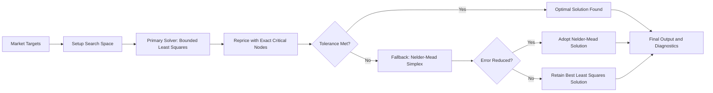

# Capital Structure OPM - Trapezoidal Pricing Engine & LRM Greeks


> A Python engine for batch valuation and risk sensitivity analysis of complex corporate capital structures using the Trapezoidal Rule and Likelihood Ratio Method (LRM).

---

## Table of Contents

1. [Introduction](#1-introduction)
   - [1.1 OPM Capital Structure Tree](#11-opm-capital-structure-tree)
   - [1.2 CCA (OPM) for Private Company Practice](#12-cca-opm-for-private-company-practice)
2. [Trapezoidal Rule Pricing](#2-trapezoidal-rule-pricing)
3. [Design Architecture](#3-design-architecture)
4. [CCA Calibration and Volatility Allocation](#4-cca-calibration-and-volatility-allocation)
   - [4.1 Calibration Objective](#41-calibration-objective)
   - [4.2 Two-Stage Hybrid Calibration Workflow](#42-two-stage-hybrid-calibration-workflow)
   - [4.3 Class-Specific Volatility Allocation (Option B)](#43-class-specific-volatility-allocation-option-b)

---

## 1. Introduction

In the valuation of private companies and complex equity structures, the Option Pricing Model (OPM) and Contingent Claim Analysis (CCA) are the core methodologies under International Financial Reporting Standards (IFRS 2) and US GAAP (ASC 718 / AICPA Valuation Guide) for allocating fair value across multiple equity classes.

This project provides a high-performance numerical integration and Likelihood Ratio Method (LRM) engine capable of simultaneously batch-computing present values (fair values) and risk sensitivities (Delta) for dozens of option classes with diverse terms across a single shared grid.

### 1.1 OPM Capital Structure Tree

The hierarchical relationship of the 50-class capital structure implemented in `portfolio.py` is as follows:

```
Total Enterprise / Equity Value (TEV, S0)
├── Class 01: Common Stock
│   ├── Share Weight: 25% - 100% (scenario-dependent, default 50% / 10.0 shares)
│   ├── Strike Price: K = 0.0 (no exercise threshold)
│   └── Vesting Condition: 100% fully vested (vest_pct = 1.0)
│
├── Class 02 - 04: PRSUs (Performance Restricted Stock Units)
│   ├── Number of Classes: 3 classes (0.15 base shares each)
│   ├── Strike Price: K = 0.0
│   ├── Hurdle Thresholds: thres in [30.0, 50.0, 80.0]
│   └── Vesting Condition: 100% discrete step vesting once hurdle is reached (is_step = 1)
│
├── Class 05 - 08: Warrants (Penny Warrants)
│   ├── Number of Classes: 4 classes (0.50 base shares each)
│   ├── Strike Price: K = 0.01
│   └── Vesting Condition: 100% fully vested (no price hurdle, thres = 0.0)
│
├── Class 09 - 20: Stock Options (Employee Stock Options)
│   ├── Number of Classes: 12 classes (0.50 base shares each)
│   ├── Strike Range: K in [2.0, 13.0] (step of 1.0)
│   └── Vesting Condition: 100% fully vested (no price hurdle, thres = 0.0)
│
├── Class 21 - 40: PIUs (Profits Interest Units)
│   ├── Number of Classes: 20 classes (0.20 base shares each)
│   ├── Strike Range: K in [18.0, 56.0] (step of 2.0)
│   ├── Hurdle Structure: Multi-tier hurdles (3 tranches for Classes 21-35; 5 tranches for Classes 36-40)
│   └── Vesting Schedule: Alternating between Continuous Linear (odd classes) and Discrete Step (even classes)
│
└── Class 41 - 50: Super PIUs (Out-of-the-Money High Hurdle PIUs)
    ├── Number of Classes: 10 classes (0.10 base shares each)
    ├── Strike Range: K in [60.0, 150.0] (step of 10.0)
    ├── Hurdle Condition: thres = multiple * 10 or K + 20.0 (high hurdles)
    └── Vesting Condition: 100% discrete step vesting once hurdle is met (is_step = 1)
```

### 1.2 CCA (OPM) for Private Company Practice

In private company equity valuation (e.g., 409A and IFRS 2), valuation specialists typically assume that Total Equity Value (TEV) follows a geometric Brownian motion (with log-normally distributed returns) and perform waterfall allocations using either Black-Scholes OPM breakpoint analysis or Monte Carlo simulation. In capital structures consisting of common shares alongside various options and warrants (or where preferred shares are treated as senior debt-like claims), practitioners often use overall equity volatility (derived from guideline public companies) as a direct proxy for common stock volatility in their simulations. This approximation is generally acceptable only when common equity represents the dominant share class (e.g., common constitutes 80%+ of TEV with minimal dilution) and leverage is negligible. In multi-tier or heavily diluted structures, however, common stock — as a junior residual claim — carries inherently higher volatility than total equity volatility, and directly substituting equity volatility risks systematically understating fair values (FVs) of options and incentive awards.

A naive fix might be to apply Merton's closed-form formula to invert $(S_0, \sigma_A)$ from observable equity data. However, Merton's closed form applies only to a single class of common equity modeled as a plain call option on assets. When the capital structure includes multi-class, multi-threshold, and step-vesting exotic awards (as in this engine), no closed-form solution exists. Numerical integration is the only tractable and exact approach.

To resolve this, our engine introduces an explicit **CCA calibration layer**: we calibrate the unobserved underlying parameters $(S_0, \sigma_A)$ jointly against the observable target TEV ($\text{TEV}_0$) and equity volatility ($\sigma_{eq}$), then apply Merton's leverage elasticity to derive exact class-specific volatilities. Unlike Monte Carlo simulation — which is stochastic and introduces random noise — **numerical integration is fully deterministic**, producing a smooth optimization landscape that enables stable, fast convergence. Per the AICPA 2019 Valuation Guide, class-specific volatilities should reflect the true economic risk of each security class, a requirement this calibration framework is designed to satisfy.

---

## 2. Trapezoidal Rule Pricing

### 2.1 Core Intuition: Numerical Integration as Pricing

The Black-Scholes closed-form solution establishes that an option's present value is the **discounted expected value** of the terminal payoff $f(S_T)$ under the risk-neutral measure:

$$V = e^{-rT} \, \mathbb{E}^{\mathbb{Q}}[f(S_T)] = e^{-rT} \int_0^{\infty} f(S_T) \cdot p(S_T) \, dS_T$$

where $p(S_T)$ is the log-normal probability density function (PDF). This integral can be computed directly via numerical evaluation using the **Trapezoidal Rule**:

$$\int_a^b g(x)\,dx \approx \sum_{i=0}^{N-1} \frac{g(x_i) + g(x_{i+1})}{2} \cdot (x_{i+1} - x_i)$$

### 2.2 Pricing Vanilla Options

Taking a European call option $f(S_T) = \max(S_T - K,\ 0)$ as an example:

```python
import numpy as np
from scipy.integrate import trapezoid
from scipy.stats import lognorm

S0, K, T, r, sigma = 100.0, 100.0, 1.0, 0.05, 0.20

# Step 1: Construct the underlying asset log-normal grid and PDF
mu    = np.log(S0) + (r - 0.5 * sigma**2) * T
s     = sigma * np.sqrt(T)
grid  = np.linspace(0, S0 * np.exp(6 * s), 10001)   # Underlying asset price range
pdf   = lognorm.pdf(grid, s=s, scale=np.exp(mu))     # Risk-neutral PDF

# Step 2: Compute terminal payoff vector
payoff = np.maximum(grid - K, 0.0)

# Step 3: Compute present value via trapezoidal integration
price = np.exp(-r * T) * trapezoid(payoff * pdf, grid)
print(f"Trapezoidal price = {price:.4f}")  # ~ 10.4506 (matches Black-Scholes closed-form)
```

In this project, this workflow is encapsulated inside `bs_price_and_delta_multiple()`:

```python
from black_scholes import bs_price_and_delta_multiple, call_option

vanilla_call = call_option(K=100.0)
prices, deltas = bs_price_and_delta_multiple(S0=100, T=1, r=0.05, q=0, sigma=0.20, payoffs={"call": vanilla_call})
price, delta = prices["call"], deltas["call"]
```


---

## 3. Design Architecture

### 3.1 Performance Breakthrough: The Mutual Grid

Constructing separate integration grids for each option would require $50 \times N$ evaluations across 50 classes.
The key insight of this engine is that: **the PDF vector $p(S_T)$ and LRM weight $w_\Delta(S_T)$ depend solely on underlying asset parameters and are completely invariant to individual option contract specifications.**

Therefore, we construct a single shared "Mutual Grid" once; all 50 classes are evaluated across this identical $(S_T, p)$ pair, reducing computational complexity to $O(N + M)$:

```
make_mutual_grid(S0, T, r, q, sigma, N)
     │
     ├── st_grid [N+1]    Shared asset price nodes
     └── pdf    [N+1]    Shared PDF vector
              │
     ┌────────┼────────┬─────────┐
     │        │        │         │
  payoff_1  payoff_2  payoff_3  ... (50 classes)
     │        │        │
  f1*pdf   f2*pdf   f3*pdf   (Vector dot products: maximum SIMD/vectorization)
     │        │        │
  trapezoid  trapezoid  trapezoid (Trapezoidal integration)
     │        │        │
    FV_1     FV_2     FV_3
```

### 3.2 LRM Delta: Differentiating Without Touching the Payoff Function

The standard approach for computing Delta relies on finite difference approximations $\frac{V(S_0 + \varepsilon) - V(S_0 - \varepsilon)}{2\varepsilon}$, requiring two complete re-pricing runs.

The breakthrough of the Likelihood Ratio Method (LRM) is shifting differentiation with respect to $S_0$ from the payoff $f(S_T)$ onto the density $p(S_T)$:

$$\Delta = \frac{\partial V}{\partial S_0} = e^{-rT} \int_0^\infty f(S_T) \underbrace{\left[ p(S_T) \cdot \frac{z}{S_0 \sigma^2 T} \right]}_{w_\Delta(S_T)} dS_T$$

where $z = \ln(S_T/S_0) - (r - q - \frac{1}{2}\sigma^2)T$ is the centered log-return.

This means computing Delta merely requires swapping $f \cdot p$ with $f \cdot w_\Delta$, **requiring zero additional re-evaluations or bumps**. In code:

```python
# PricingGrid encapsulates the delta_weight vector; created once for all classes
w_delta = grid.delta_weight   # Core LRM Delta weight vector: z_pdf * z / (S0 * sigma * sqrt(T))

# Deltas for all 50 classes are evaluated across this identical w_delta
d[k] = grid.discount * trapezoid(fn(grid.st_grid) * w_delta, grid.z_grid)   # Requires only 1 integration pass
```

### 3.3 Module Structure

```
opm/
├── black_scholes.py     # Core engine
│   ├── PricingGrid                    - Dataclass: shared z-grid, ST, PDF, delta_weight, discount
│   ├── call_option()                  - Unified exotic option payoff factory
│   ├── _build_pricing_grid()          - Builds mutual z-space grid with critical points injection
│   ├── make_mutual_grid()             - Public API: shared asset grid & lognormal density
│   ├── bs_price_and_delta_multiple()  - Public API: simultaneous FV and LRM Delta calculation
│   ├── call_closed_form()             - Exact analytical pricing benchmark for step/linear options
│   ├── call_closed_form_delta()       - Exact analytical Delta benchmark for step/linear options
│   ├── equity_moments()              - Calculates portfolio TEV0 and Merton implied equity volatility
│   ├── calibrate_cca()               - Two-stage hybrid calibration (TRF Least-Squares + Nelder-Mead)
│   ├── MarketParams                  - Dataclass: market inputs and grid settings
│   ├── CalibrationTargets            - Dataclass: target TEV and equity volatility
│   ├── calc_portfolio_allocations()  - Omega, Elasticity, and Option B Specific Vol per class
│   └── run_opm_analysis()            - Comprehensive text report generation
│
├── portfolio.py         # Capital structure definitions
│   ├── build_capital_structure()       - Builds the 50-class capital structure (flexible Common ratio)
│   └── build_capital_structure_X_Y()   - Preset scenario builders (100/0, 90/10, 75/25, 50/50, 25/75)
│
├── generate_report.py   # HTML report generation
│   └── generate_html_report()          - Generates multi-scenario 2x4 sensitivity matrix report (index.html)
│
└── main.py              # Entry point: runs reports and opens browser automatically
```

---

## 4. CCA Calibration and Volatility Allocation

### 4.1 Calibration Objective

Under the Contingent Claim Analysis (CCA) framework, the unobserved underlying parameters $(S_0, \sigma_A)$ must be inverted from observable market inputs (target equity fair value $\text{TEV}_0^{\text{target}}$ and equity volatility $\sigma_{eq}^{\text{target}}$). `calibrate_cca()` inverts the following non-linear least-squares loss function (or residual vector $\mathbf{R}(S_0, \sigma_A) = [r_{\text{val}}, r_{\text{vol}}]^T$):

$$\mathcal{L}(S_0, \sigma_A) = \underbrace{\left(\frac{\text{TEV}(S_0, \sigma_A) - \text{TEV}_0^{\text{target}}}{\text{TEV}_0^{\text{target}}}\right)^2}_{\text{Market Value Error}} + \underbrace{\left(\frac{\sigma_{eq}(S_0, \sigma_A) - \sigma_{eq}^{\text{target}}}{\sigma_{eq}^{\text{target}}}\right)^2}_{\text{Volatility Error}}$$

where $\sigma_{eq}$ is computed via the **Merton leverage-elasticity formula**, using the portfolio-level Delta from numerical integration:

$$\sigma_{eq}(S_0, \sigma_A) = \sigma_A \cdot \frac{S_0 \cdot \Delta_{\text{total}}}{\text{TEV}_0}$$

where $\Delta_{\text{total}} = \sum_i N_i \Delta_i$ is the aggregate portfolio Delta computed on the shared mutual grid. This is numerically exact for any payoff structure and directly consistent with the Itô-chain-rule derivation of equity volatility.

To accelerate convergence, the solver establishes adaptive bounds and an initial guess for $S_0$ and $\sigma_A$:
- $S_0^{\text{guess}} = \frac{\text{TEV}_0}{\sum \text{Shares}}$ (or target common share price $S_0^{\text{target}}$ if provided)
- $\sigma_A^{\text{guess}} = \max(\sigma_{eq}^{\text{target}}, 0.05)$ (Initial asset volatility)

### 4.2 Two-Stage Hybrid Calibration Workflow

To ensure both fast computation on standard portfolios and reliable convergence on complex structures with vesting thresholds, `calibrate_cca()` uses a two-stage decision flow:



#### Workflow Stages:
1. **Setup Search Space**: Ingests market equity targets, unrolls the capital structure, and establishes adaptive parameter bounds and initial estimates.
2. **Primary Solver**: Runs a bounded least-squares optimization (`scipy.optimize.least_squares` with TRF) using a smooth, fixed integration grid for stable gradient estimation.
3. **Quality Gate Verification**: Evaluates the candidate solution against exact strike and hurdle nodes to verify that value and volatility tolerances are satisfied.
4. **Nelder-Mead Fallback**: If non-smooth vesting thresholds prevent the gradient solver from reaching the required tolerance, a derivative-free simplex search explores the local landscape to find a tighter fit.
5. **Diagnostics & Output**: Compares candidate fits, verifies boundary constraints, and generates class-by-class fair values and risk metrics.

### 4.3 Class-Specific Volatility Allocation (Option B)

Post-calibration, the engine allocates the aggregate $\sigma_{eq}^{\text{target}}$ to individual classes via **relative leverage projection**:

$$\sigma_{i,\text{alloc}} = \sigma_{eq}^{\text{target}} \times \frac{\text{TEV}_0 \cdot \Delta_i}{V_i \cdot \Delta_{\text{total}}}$$

**Why does this guarantee that the weighted sum equals the target?**

$$\sum_i \frac{N_i V_i}{\text{TEV}_0} \cdot \sigma_{i,\text{alloc}} = \sigma_{eq}^{\text{target}} \cdot \frac{\sum_i N_i \Delta_i}{\Delta_{\text{total}}} = \sigma_{eq}^{\text{target}} \cdot 1 = \sigma_{eq}^{\text{target}}$$


